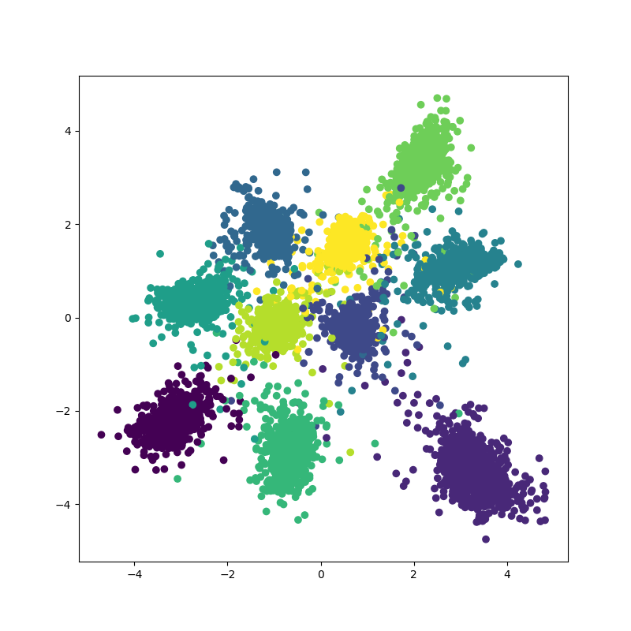

Triplet Loss Utility for Pytorch Library.

# TripletTorch

TripletTorch is a small pytorch utility for triplet loss projects. It provides
simple way to create custom triplet datasets and common triplet mining loss
techniques.

## Install

Install the module using the pip utility ( may require to run as sudo ).

```bash
pip3 install triplettorch
```

## Usage

### Triplet Dataset

```python
from triplettorch import TripletDataset

# Create a triplet dataset given:
#   * labels  : array of label ( class ) for each sample of the dataset
#   * data_fn : method to access data for a given index in the dataset
#   * size    : number of samples in the dataset
#   * n_sample: number of sample per draw ( to increase probability to
#               contain valid triplets in a batch )
# Do not forget to concatenate batch dimension and sample dimension
# when used with a DataLoader as TripletDataset[ idx ] returns a
# ( batch_size, n_sample, ... ) dimension tensor for labels and data
dataset = TripletDataset( labels, data_fn, size, n_sample )
```

### Triplet Mining

```python
from triplettorch import AllTripletMiner, HardNegativeTripletMiner

# Define the triplet mining loss given:
#   * margin: the margin float value from the triplet loss definition
miner          = AllTripletMiner( .5 ).cuda( )
miner          = HardNegativeTripletMiner( .5 ).cuda( )

# Use the loss in training given:
#   * labels    : array of label ( class ) for each sample of the batch
#   * embeddings: output of the neural network for each sample of the batch
# Returns two values:
#   * loss    : triplet loss value
#   * frac_pos: fraction of positive triplets
#               None ( None HardNegativeTripletMiner )
loss, frac_pos = miner( labels, embeddings )
```

## Example

The repository provides an example application with the MNIST dataset.




## References
* [FaceNet: A Unified Embedding for Face Recognition and Clustering]
* [Triplet Loss and Online Triplet Mining in TensorFlow]

[FaceNet: A Unified Embedding for Face Recognition and Clustering]: https://arxiv.org/pdf/1503.03832.pdf
[Triplet Loss and Online Triplet Mining in TensorFlow]:https://omoindrot.github.io/triplet-loss
